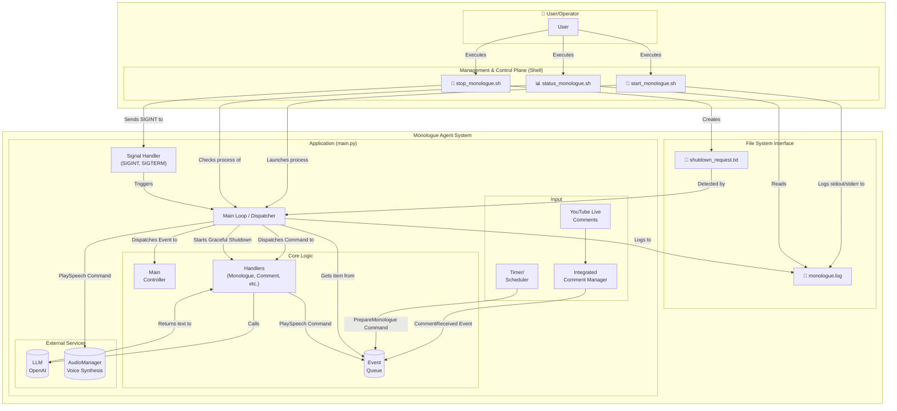
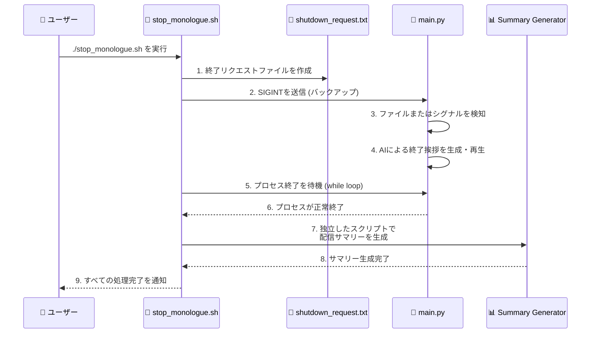
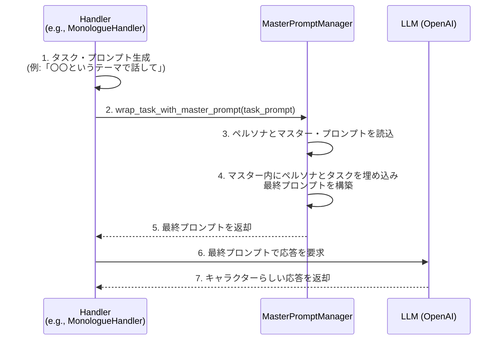

## はじめに

こんにちは!個人開発者のyasunaです。

AITuberの開発をライフワークとしている私とろてじんさん(@rotejin)が開発したAITuberプロジェクト「AITuberぶつぶつシステム」は、詩を参照して自律的に思考し、視聴者と対話しながら配信を行うことを目的としています。

今回はこの少々複雑なシステムを安定して動作させるために、イベント駆動型のアーキテクチャを採用しました。

今回は、そのアーキテクチャの根幹をなすコードを読み解きながら、システム全体の設計思想やコンポーネント間の連携について解説していきます。
こちらのプロジェクトの経緯については以下のnoteをご覧ください！

https://note.com/yasunacoffee/n/n2cd75650210a

このシステムを使って配信を行った動画はこちらです！
https://www.youtube.com/live/GvLcysqJIuk?t=36s

リポジトリ
https://github.com/YasunaCoffee/AITuberMurmurSystem

なお、以下はこのリポジトリをもとにAIを活用して記事を書いています。

### アーキテクチャ図

以下は、システム全体のアーキテクチャ図になります。



#### 図の解説

この図は、システムが大きく2つの層で構成されています。

*   **管理・制御プレーン (Management & Control Plane)**:
    *   ユーザーは`start/stop/status`の各シェルスクリプトを直接操作します。これがシステムの操作インターフェースです。
    *   これらのスクリプトは、Pythonアプリケーション本体を直接制御するのではなく、ファイル(`shutdown_request.txt`)やシグナルといった間接的な手段でアプリケーションと連携します。これにより、両者の結合度を下げ、堅牢性を高めています。

*   **Monologue Agentシステム (Application)**:
    *   Pythonアプリケーション(`main.py`)は、シェルスクリプトからの起動や終了要求を受け取り、実際のAIとしての動作（コメント取得、応答生成、音声再生など）を実行します。
    *   内部はイベントキューを中心としたイベント駆動アーキテクチャとなっており、各機能が疎に結合されています。

このように、システムは「Pythonアプリケーション本体」とそれを取り巻く「シェルスクリプトによる管理層」の2層構造になっており、ファイルやシグナルを介して連携することで、柔軟なプロセス管理を実現しています。

### システムの全体像：イベントキューが繋ぐ疎結合な世界

このプロジェクトの設計で特に重視したのは、**責務の分離**と**非同期処理**です。
音声生成、コメント処理、独り言の生成など、様々なタスクが同時に発生する中で、各機能が互いに干渉せず、独立して動作する必要があります。

そのために導入したのが、`EventQueue`です。

`main.py`の冒頭を見ると、多くのコンポーネントが`EventQueue`を介して連携していることがわかります。

```python
from v2.core.event_queue import EventQueue
from v2.core.events import (
    AppStarted,
    Command,
    PlaySpeech,
    // ...
)
from v2.controllers.main_controller import MainController
from v2.services.audio_manager import AudioManager
from v2.handlers.monologue_handler import MonologueHandler
```

各コンポーネント（`Handler`や`Service`）は、他のコンポーネントを直接呼び出す代わりに、`Event`や`Command`オブジェクトを生成して`EventQueue`に投入（`put`）します。メインループはキューを監視し、投入されたアイテムに応じた処理をディスパッチします。

この設計により、例えば`CommentHandler`は「コメントへの返答を生成して音声再生を依頼する」という要求（`PlaySpeech`コマンド）をキューに入れるだけでよく、実際の音声再生処理がどう行われるかを気にする必要がありません。これにより、各コンポーネントの独立性が高まり、機能追加や改修が容易になっています。

### `main.py`のライフサイクル

それでは、アプリケーションが起動してから終了するまでの流れを、`main`関数の処理に沿って見ていきましょう。

#### 1. 初期化フェーズ

`main`関数は、アプリケーションの生命線を握るコンポーネント群を初期化し、それらを結びつける役割を担います。

1.  **コアコンポーネントの生成**:
    *   `EventQueue`: システム全体のイベントバス。
    *   `StateManager`: `is_running`フラグなど、アプリケーション全体の状態を管理します。
2.  **サービスとハンドラの初期化**:
    *   `AudioManager`: 音声の合成と再生を非同期で担当します。
    *   `MonologueHandler`, `CommentHandler`, `GreetingHandler`など: それぞれが特定のドメインロジック（独り言、コメント返信、挨拶など）を担当する専門家です。これらは協調して動作しますが、互いの実装には依存しません。
3.  **コマンドとハンドラのマッピング**:
    どの`Command`がどのハンドラのメソッドによって処理されるかを定義した辞書です。これにより、メインループは機械的にコマンドを適切なハンドラに振り分けることができます。

    ```python
    command_handlers = {
        PlaySpeech: audio_manager.handle_play_speech,
        PrepareMonologue: monologue_handler.handle_prepare_monologue,
        // ...
    }
    ```

4.  **コントローラーの初期化**:
    *   `MainController`: `Event`を処理する中心的なコンポーネントです。アプリケーションの主要な状態遷移ロジックはここに集約されています。

#### 2. 起動とメインループ

すべての準備が整うと、`main`関数はバックグラウンドスレッド（コメント監視など）を開始し、`AppStarted`イベントをキューに投入してメインループを開始します。

```python
# 7. メインループ（イベント/コマンドディスパッchaー）
print("[Main] Starting main loop...")
print("Press Ctrl+C to exit gracefully.")

try:
    while state_manager.is_running:
        try:
            item = event_queue.get(timeout=0.1) # キューからアイテムを取得

            if isinstance(item, Command):
                # コマンドであれば、マッピングされたハンドラで処理
                handler = command_handlers.get(type(item))
                if handler:
                    handler(item)
            else:  # イベントであれば、メインコントローラで処理
                main_controller.process_item(item)
```

このループが、システムの心臓部です。非常にシンプルですが、イベント駆動アーキテクチャの強力なところは、このループ自体が具体的な処理内容を知らない点にあります。ただキューからアイテムを取り出し、適切な担当者へ渡すだけ。これにより、ロジックの追加や変更がメインループに影響を与えることはありません。

#### 3. フィラー
`main.py`には、AITuberをより自然に見せるための工夫が凝らされています。

*   **つなぎフレーズ (`_handle_empty_queue_filler`)**:
    イベントキューが空、つまりAIが何も話していない状態が続くと、`_handle_empty_queue_filler`関数が呼び出されます。「えーっと。」や「そうですね。」といった「つなぎ言葉」をランダムに再生することで、キャラクターが考え込んでいるような自然な「間」を演出します。

### 多層的なシャットダウン機構：ただ消すだけではない「さよならの挨拶」

このAITuberぶつぶつシステムの終了プロセスは、単にプロセスを停止させるだけではありません。`stop_monologue.sh`スクリプトと`main.py`が連携し、視聴者体験を最後まで考慮した、多層的で堅牢なシャットダウン機構を実装しています。

`stop_monologue.sh`は、状況に応じて使い分けられる2つの停止モードを提供します。

1.  **通常モード (Graceful Shutdown)**:
    *   `./stop_monologue.sh`か`./stop_monologue.ps1`で実行します。
    *   **ファイルベースの通信**: `shutdown_request.txt`を作成し、`main.py`に終了を「お願い」します。これが最も確実で主要な通信手段です。
    *   **終了挨拶**: `main.py`はこのリクエストを検知し、専用のAIプロンプトを用いてその日の対話を振り返る「終わりの挨拶」を生成・再生します。
    *   **無制限待機**: スクリプトは`main.py`が挨拶を終え、自然に終了するまで無制限に待ち続けます。
    *   **配信サマリー生成**: プロセス終了後、スクリプトは独立したPythonプロセスを起動し、その日の配信内容のサマリー（テキストファイルなど）を生成します。

2.  **強制モード (Forced Shutdown)**:
    *   `./stop_monologue.sh --force`で実行します。
    *   `kill -9`シグナルを送信し、アプリケーションを即座に強制終了させます。
    *   挨拶やサマリー生成は行われません。デバッグ時や、システムが応答しなくなった際の緊急脱出用です。

#### 終了プロセスの流れ

通常モードにおける、スクリプトとアプリケーションの連携フローは以下のようになります。



この設計により、以下の利点が生まれます。

*   **信頼性**: シグナルが何らかの理由でブロックされても、ファイルベースのリクエストによって確実に終了処理を開始できます。
*   **責務の分離**: AIによる挨拶は`main.py`の責務、終了後のサマリー生成は`stop_monologue.sh`の責務と分けることで、メインアプリケーションの複雑さを低減しています。
*   **優れたユーザー体験**: 配信が唐突に終わるのではなく、キャラクターがきちんと挨拶をしてから終了するため、視聴者に丁寧な印象を与えます。

### キャラクターらしさ（ペルソナ）の実装

本システムが単なる応答ボットではなく、一貫した「キャラクター」として振る舞えるのは、多層的なプロンプト設計によるものです。この心臓部となるのが`MasterPromptManager`であり、以下の3つの階層のプロンプトを動的に組み合わせることで、AIにペルソナを注入しています。

1.  **ペルソナ・プロンプト (`persona_prompt.txt`) - 「私は誰か？」**
    *   キャラクターの根幹を定義する最下層のプロンプトです。
    *   名前、一人称、性格、口調、価値観、背景設定など、キャラクターの不変的なアイデンティティを記述します。
    *   例：「私の名前は〇〇です。一人称は「私」を使い、常に冷静沈着な態度を保ちます。詩的な表現を好みます。」
    *   このプロンプトを変更するだけで、AIの基本人格を全くの別人に変えることができます。

2.  **マスター・プロンプト (`master_prompt.txt`) - 「私の役割は何か？」**
    *   ペルソナの上に乗る、キャラクターとしての行動規範を定義する中間層のプロンプトです。
    *   視聴者との対話方法、コメントへの反応の仕方、話す内容の制約、配信全体の目的といった、アプリケーション全体の共通ルールをAIに指示します。
    *   このプロンプトには、後述の「タスク・プロンプト」を埋め込むためのプレースホルダー（例：`{specific_task_prompt}`）が含まれています。

3.  **タスク・プロンプト (各Handlerが生成) - 「今、何をすべきか？」**
    *   「独り言を話す」「コメントに返信する」「挨拶をする」といった、その時々の具体的な指示を定義する最上層のプロンプトです。
    *   これは`MonologueHandler`や`CommentHandler`といった専門のハンドラが、状況に応じて動的に生成します。
    *   例えば、`--theme`で指定されたファイルの内容も、このタスク・プロンプトの一部として組み込まれます。

#### 処理フロー

キャラクターらしい応答が生成されるまでの流れは以下の通りです。



この階層的なアプローチにより、「ペルソナ（人格）」と「役割（機能）」、「タスク（指示）」を明確に分離しています。これにより、開発者はアプリケーションのコアロジックに触れることなく、テキストファイルを編集するだけでキャラクターの微調整や変更、新しい対話タスクの追加が容易に行える、非常にメンテナンス性と拡張性の高い設計を実現しています。

### まとめ
今回はキャラクターの会話の自然さに特にこだわってシステムを開発しました！
こちらはMITラインセンスで公開していますのでぜひたくさん使ってあなたらしいキャラクターを生み出してみてくださいね！

また、コントリビュートも絶賛お待ちしています！イシューと合わせてあなたのプルリク熱望していますよ～！
感想などありましたらぜひXまでお寄せください！

https://x.com/yasun_ai/status/1950920133469425943

https://github.com/YasunaCoffee/AITuberMurmurSystem
