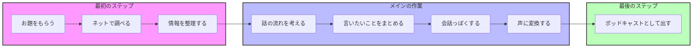

# はじめに

ここに記事の内容を書いていきます。

```mermaid
graph LR
    subgraph 最初のステップ
        A[お題をもらう] --> B[ネットで調べる]
        B --> C[情報を整理する]
    end

    subgraph メインの作業
        C --> D[話の流れを考える]
        D --> E[言いたいことをまとめる]
        E --> F[会話っぽくする]
        F --> G[声に変換する]
    end

    subgraph 最後のステップ
        G --> H[ポッドキャストとして出す]
    end

    style 最初のステップ fill:#f9f,stroke:#333,stroke-width:2px
    style メインの作業 fill:#bbf,stroke:#333,stroke-width:2px
    style 最後のステップ fill:#bfb,stroke:#333,stroke-width:2px
``` 